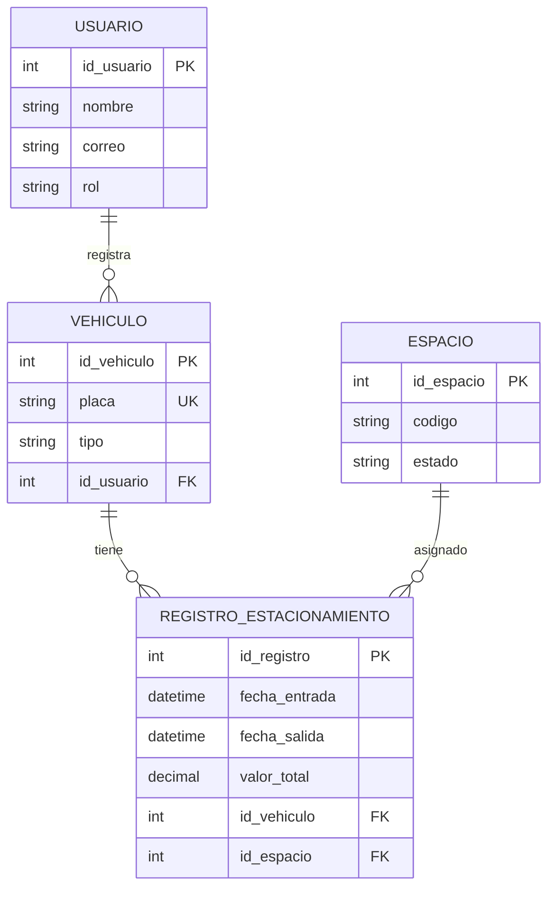

# Diagrama Entidad-Relación - ZonaPark

```mermaid
erDiagram
    USUARIO ||--o{ VEHICULO : registra
    VEHICULO ||--o{ REGISTRO_ESTACIONAMIENTO : tiene
    ESPACIO ||--o{ REGISTRO_ESTACIONAMIENTO : asignado

    USUARIO {
        int id_usuario PK
        string nombre
        string correo
        string rol
    }

    VEHICULO {
        int id_vehiculo PK
        string placa UK
        string tipo
        int id_usuario FK
    }

    ESPACIO {
        int id_espacio PK
        string codigo
        string estado
    }

    REGISTRO_ESTACIONAMIENTO {
        int id_registro PK
        datetime fecha_entrada
        datetime fecha_salida
        decimal valor_total
        int id_vehiculo FK
        int id_espacio FK
    }
```
